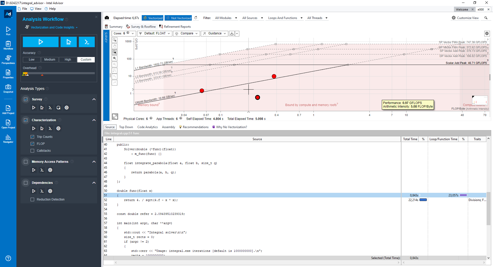

# Лабораторная работа № 1

## Задание 1

```
D:\8242217\EHC-LABS\ehc-labs>build\LABS\SR1\integral.exe
Integral solver

Usage: integral.exe iterations [default is 1000000000].
Elapsed time: 5.33735
Reference answer: 2.0944
Answer: 2.09439
Delta: 1.80137e-07
```

## Задание 2 (метод парабол)

Что добавил:

```cpp
double parabola(float a, float b, size_t n) {
    if (n % 2 != 0) {
        ++n;
    }
    const double h = (b - a) / n;
    double result = m_func(a) + m_func(b);
    double c{};

    #pragma omp parallel for
    for (size_t i = 1; i < n; ++i) {
        double coeff = (i % 2 == 0) ? 2.0 : 4.0;
        kahan_sum(coeff * m_func(a + i * h), result, c);
    }
    result *= h / 3.0;
    return result;
}
```

Вывод:

```
D:\8242217\EHC-LABS\ehc-labs>build\LABS\SR1\integral.exe
Integral solver

Usage: integral.exe iterations [default is 1000000000].
Elapsed time: 5.63482
Reference answer: 2.0944
Answer: 2.09439
Delta: 1.80137e-07
```

## Задание 3

Запуск 1 (в прошлый раз)


Запуск 2 (сегодня) (без рекомендаций):




## Задание 4

Эффективность работы параллельной версии приложения через Intel VTune:


