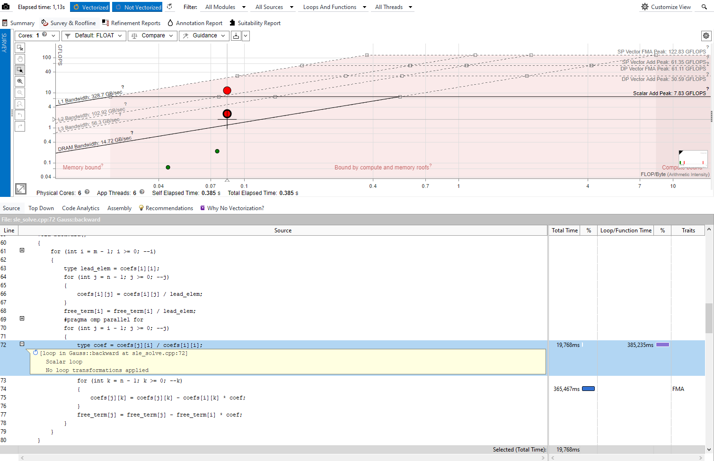
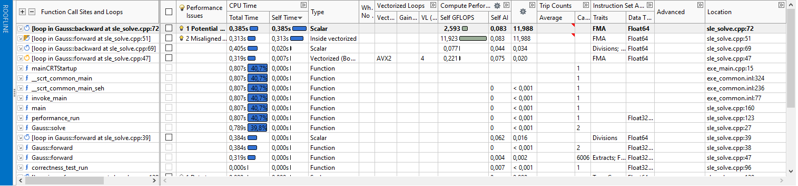

# Лабораторное задание №2

## Задание 1

```
[main] Building folder: ehc-labs sle
[build] Starting build
[proc] Executing command: "C:\Program Files\CMake\bin\cmake.EXE" --build d:/8242217/EHC-LABS/ehc-labs/build --config Debug --target sle -j 8 --
[build] [1/2  50% :: 3.091] Building CXX object LABS\SR2\CMakeFiles\sle.dir\sle_solve.cpp.obj
[build] icx: warning: argument unused during compilation: '-Qopt-report:5' [-Wunused-command-line-argument]
[build] [2/2 100% :: 4.429] Linking CXX executable LABS\SR2\sle.exe
[build] Build finished with exit code 0
```

## Задание 2





## Задание 3

```
[main] Building folder: ehc-labs sle
[build] Starting build
[proc] Executing command: "C:\Program Files\CMake\bin\cmake.EXE" --build d:/8242217/EHC-LABS/ehc-labs/build --config Debug --target sle -j 8 --
[build] 2 warnings generated.
[build] [2/2 100% :: 3.389] Linking CXX executable LABS\SR2\sle.exe
[build] Build finished with exit code 0
```


## Задание 4

### Анализ на Inspector

#### Memory problems


#### Threading problens

Также `No problems detected`.

### Анализ на VTune


