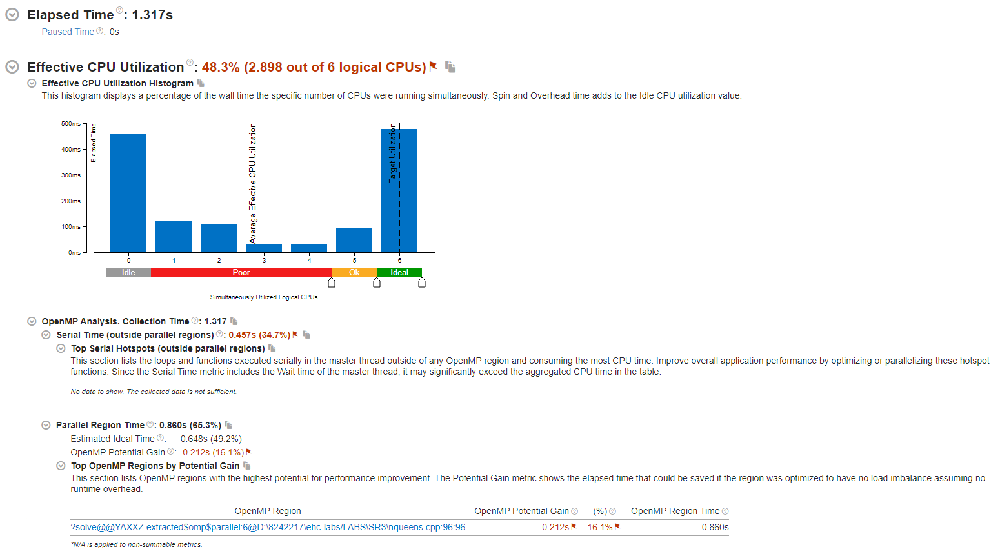

# Лабораторная работа №3

## Задание 1

```
D:\8242217\ehc-labs\build>"D:\Program Files\oneAPI\compiler\latest\windows\bin\icx.exe"  /nologo /TP /DWIN32 /D_WINDOWS /EHsc /Zi /Ob0 /Od /RTC1 -MDd /Qopt-report:max /QxCORE-AVX2 /ZI /DEBUG /Qipo- /Qopenmp /O3 -Qstd=c++17 /FoLABS\SR3\CMakeFiles\nqeens.dir\nqueens.cpp.obj /FdTARGET_COMPILE_PDB -c D:\8242217\ehc-labs\LABS\SR3\nqueens.cpp
2 warnings generated.
```

## Задание 2


## Задание 3


