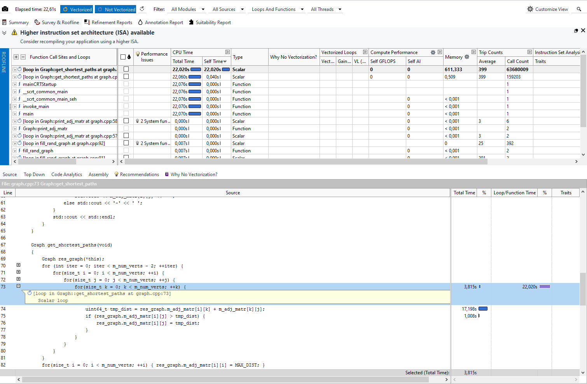
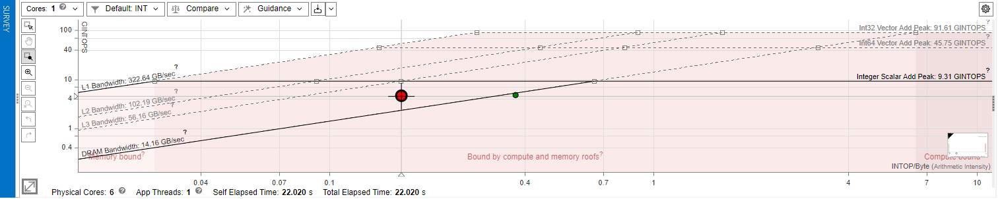
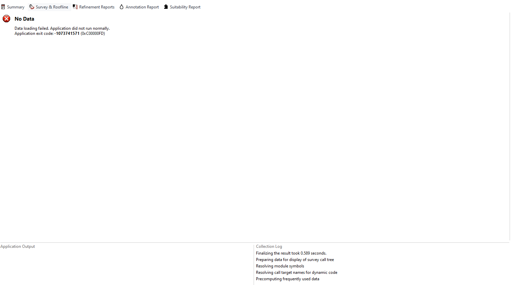

# Лабораторная работа №4

## Задание 1

```
[main] Building folder: EHC-LABS graph
[build] Starting build
[proc] Executing command: "C:\Program Files\CMake\bin\cmake.EXE" --build d:/8242217/EHC-LABS/build --config Debug --target graph -j 8 --
[build] [1/2  50% :: 1.292] Building CXX object LABS\SR4\CMakeFiles\graph.dir\graph.cpp.obj
[build] [2/2 100% :: 4.067] Linking CXX executable LABS\SR4\graph.exe
[build] Build finished with exit code 0
```

## Задание 2

Использовано потоков: 1





## Задание 3

За счёт добавления последовательного ускорения, программа идёт так быстро, что [не обрабатывается информация](http://web.archive.org/web/20240810101110/https://www.intel.com/content/www/us/en/docs/advisor/user-guide/2024-2/no-data-is-collected.html):

